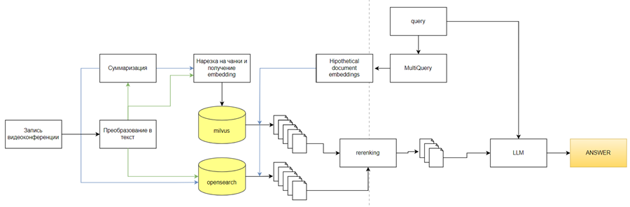
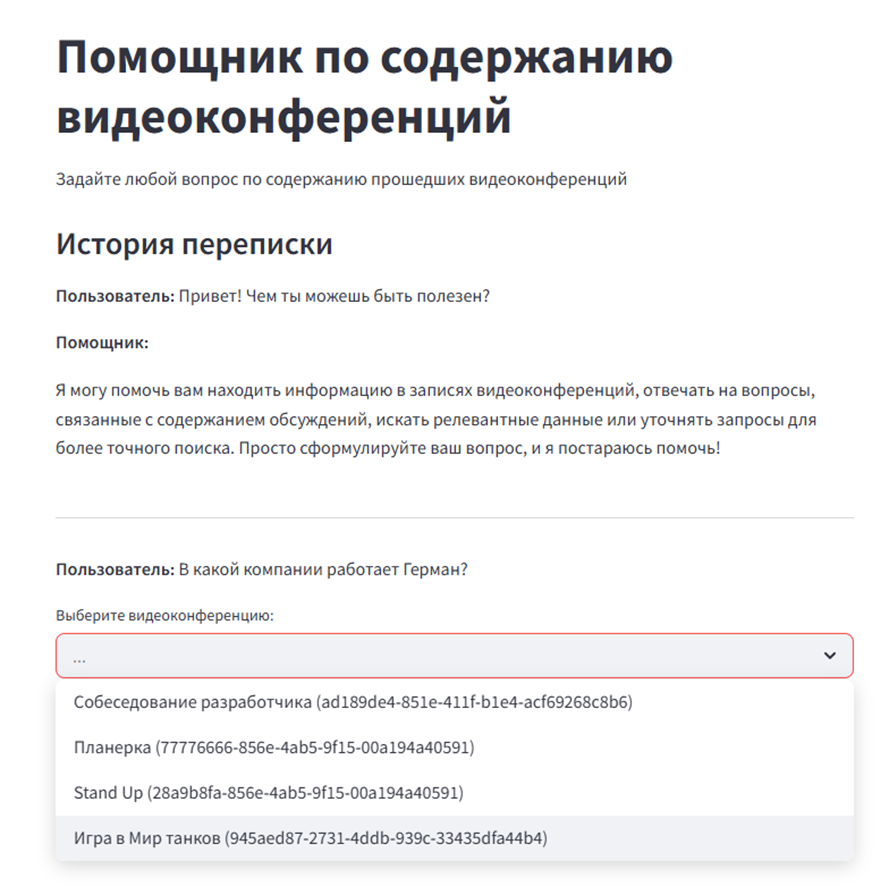
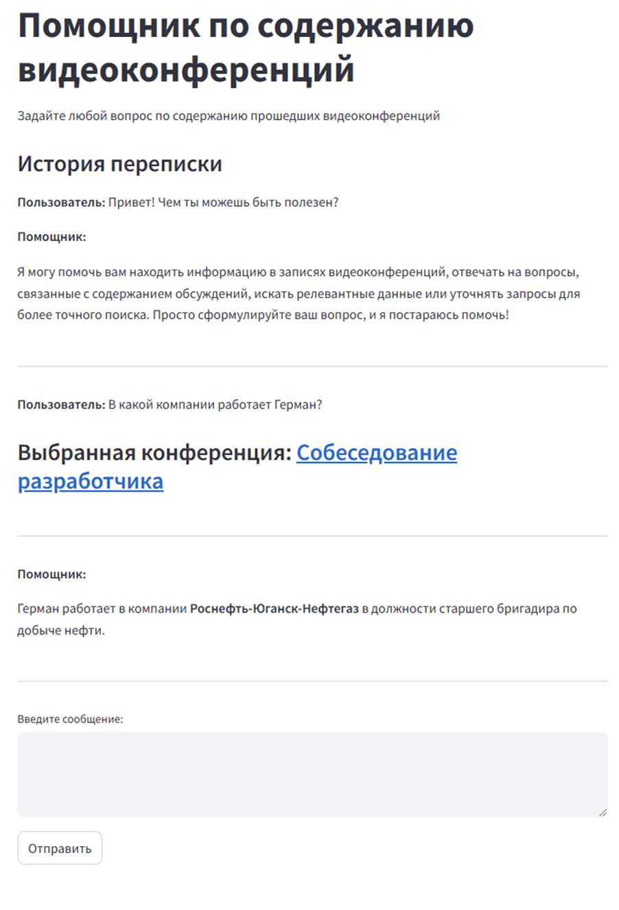

## Цель и область применения

Настоящий документ представляет собой комплексный обзор репозитория конференционной RAG-системы — готового к промышленному использованию решения для обработки аудиофайлов видеоконференций с поддержкой интеллектуального вопросно-ответного интерфейса на основе Retrieval-Augmented Generation (RAG). Система автоматически транскрибирует записи конференций, разбивает их на поисковые фрагменты и предоставляет диалоговый интерфейс для извлечения информации из материалов встреч.


## Архитектура системы

Конференционная RAG-система построена по принципам микросервисной архитектуры с событийно-ориентированной коммуникацией. Система обрабатывает аудиофайлы через многоступенчатый конвейер, сохраняет результаты в специализированных базах данных и предоставляет возможности как поиска, так и генерации ответов на пользовательские запросы.

### Высокоуровневая архитектура



## Основные компоненты

Система состоит из семи основных сервисов, взаимодействующих для обработки аудио и предоставления интеллектуального поиска:

| Сервис | Порт | Назначение | Зависимости |
|---------|------|---------|--------------|
| `rag_service` | 8510 | Streamlit-интерфейс для взаимодействия с пользователем | `retriever_service` |
| `retriever_service` | 8503 | Комбинирует векторный и текстовый поиск с переранжированием | `embedder_service`, `reranker_service` |
| `embedder_service` | 8500 | Генерирует эмбеддинги предложений с использованием `sentence-t5-xl` | Нет |
| `reranker_service` | 8502 | Переранжирует результаты поиска с помощью `bert-multilingual` | Нет |
| `db_saver_service` | 8501 | Сохраняет обработанные фрагменты в базы данных | `embedder_service` |
| `segmenter_service` | - | Обрабатывает транскрипции и создает суммаризации | OpenAI API |
| `transcriber_service` | - | Конвертирует аудио в текст с использованием моделей Whisper | S3-хранилище |

## Технологический стек

Система использует современные технологии, оптимизированные для масштабируемой обработки текста и семантического поиска:

### Базовые технологии

| Компонент | Технология | Конфигурация |
|-----------|------------|---------------|
| **Векторная БД** | Milvus Standalone | Коллекция: `video_confs`, 768-мерные эмбеддинги |
| **Текстовый поиск** | OpenSearch Cluster | Индекс: `video_confs`, 4 шарда |
| **Очередь сообщений** | Apache Kafka | Bootstrap-серверы: `81.94.158.131:9092` |
| **Объектное хранилище** | S3-совместимое MinIO | Хранение аудиофайлов |
| **Мониторинг** | Arize Phoenix | Сбор и анализ трейсов |
| **Хранилище метаданных** | PostgreSQL | Сохранение трейсов Phoenix |

### ИИ/ML модели

| Тип модели | Название модели | Сервис | Назначение |
|------------|------------|---------|---------|
| **Речь-в-текст** | `whisper-large-v3-russian` | transcriber | Транскрибация аудио |
| **Эмбеддинги** | `sentence-t5-xl` | embedder | Генерация семантических векторов |
| **Переранжирование** | `bert-multilingual-passage-reranking-msmarco` | reranker | Оптимизация результатов поиска |
| **Языковая модель** | `qwen3:8b` | LLM API | Генерация и суммаризация текста |


## Управление конфигурацией

Система использует централизованный подход к конфигурации с переменными окружения, определенными в [system/.env](). Основные категории настроек:

- **Подключения к БД**: URI Milvus, учетные данные OpenSearch, параметры PostgreSQL
- **Топики Kafka**: Имена входных/выходных топиков и идентификаторы групп потребителей
- **Параметры моделей**: Размеры фрагментов, размерности эмбеддингов, настройки инференса
- **API-эндпоинты**: URL сервисов для межкомпонентного взаимодействия
- **Мониторинг**: Настройки трейсинга Phoenix и именования проектов


## Развертывание

1. Установить docker с поддержкой GPU.
2. Выполнить команду ```sudo sysctl -w vm.max_map_count=262144``` иначе opensearch не запустится
3. Перейти в папку system и выполнить ```sudo docker compose up -d```
4. Перейти по адресу http://localhost:8510

Далее можно взаимодейстовать с чатом



